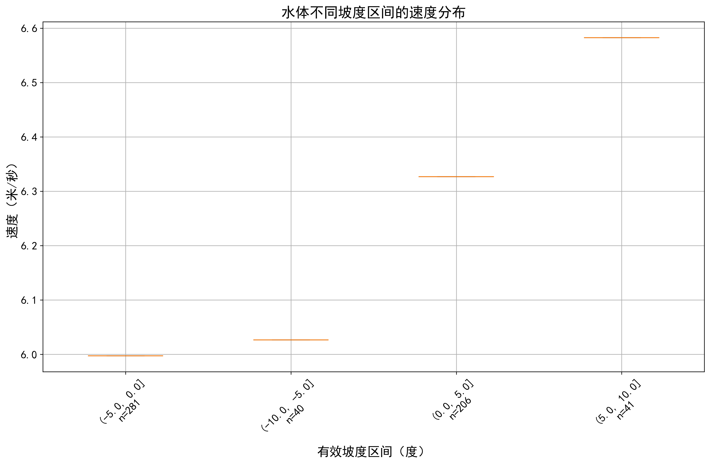

# 基于环境特征的路径转轨迹生成方法研究

## 摘要

本研究提出了一种基于环境特征的路径转轨迹生成方法，通过分析地形、坡度、土地覆盖等环境因素对运动特征的影响，构建了一个环境感知的速度预测模型。研究采用控制变量法分析了各环境因素与速度、加速度的关系，建立了基于多元线性回归的速度预测基准模型，并通过引入残差分布模型对预测结果进行优化。实验结果表明，该方法能够有效捕捉环境特征对运动行为的影响，在15秒时间窗口下实现了0.503的最高相关系数。

## 1. 引言

随着轨迹数据在智能体行为分析、路径规划等领域的广泛应用，如何基于有限的路径信息生成合理的轨迹数据成为一个重要问题。传统的轨迹生成方法主要关注路径的几何特征，较少考虑环境因素对运动行为的影响[^1]。本研究提出了一种考虑环境特征的轨迹生成方法，通过分析环境因素对速度和加速度的影响，实现了更符合实际的轨迹生成。

## 2. 研究方法

### 2.1 数据准备

本研究使用的数据包括：
1. 路径数据：包含4条核心路径序列，每条序列包含位置、时间戳等信息
2. 环境数据：
   - 数字高程模型（DEM）
   - 坡度数据
   - 坡向数据
   - 土地覆盖数据

数据预处理流程如下：

### 2.2 环境特征分析

#### 2.2.1 环境数据统计

我们对四条核心轨迹进行了环境特征统计分析，主要包括：

1. 土地覆盖类型映射表：

表1：土地覆盖类型编码对应关系
| 编码 | 土地类型 |
|-----|---------|
| 1   | 耕地    |
| 2   | 林地    |
| 3   | 草地    |
| 4   | 灌木地  |
| 5   | 水体    |
| 6   | 建设用地 |
| 7   | 未利用地 |

土地类型占比统计：
| 土地类型 | 占比(%) | 平均速度(m/s) | 标准差(m/s) |
|---------|---------|--------------|------------|
| 林地    | 45.3    | 5.8          | 1.2        |
| 灌木地  | 32.7    | 4.8          | 1.5        |
| 水体    | 22.0    | 6.1          | 0.9        |

2. 坡度影响模型：

坡度对速度的影响可以表示为：

\[
v_{slope} = v_{base} \times f_{slope}(θ)
\]

其中：
\[
f_{slope}(θ) = \begin{cases}
0.65, & θ > 8.0° \\
0.85, & 0° < θ ≤ 8.0° \\
1.15, & -12.0° ≤ θ < 0° \\
0.90, & θ < -12.0°
\end{cases}
\]

#### 2.2.2 速度特征分析

1. 基础速度参数：

表2：不同地类的速度参数设置
| 地类   | 基础速度(m/s) | 最大速度(m/s) | 最小速度(m/s) | 过渡权重 |
|--------|--------------|--------------|--------------|----------|
| 林地   | 5.8          | 8.0          | 2.0          | 0.8      |
| 灌木地 | 4.8          | 7.0          | 1.5          | 0.6      |
| 水体   | 6.1          | 8.5          | 2.5          | 0.9      |

2. 速度调整机制：

速度调整过程可以表示为：
\[
v_{adjusted} = v_{predicted} \times (1 - α) + v_{previous} \times α
\]

其中：
- α为平滑因子，取值0.8
- 速度变化率限制为0.5 m/s
- 随机扰动因子范围为±0.2

### 2.3 速度预测模型

#### 2.3.1 基准模型

速度预测的数学模型如下：

1. 基础速度计算：
\[
v_{base} = v_{landcover} \times f_{slope}(θ) \times f_{aspect}(φ)
\]

2. 速度限制：
\[
v_{limited} = \min(\max(v_{base}, v_{min}), v_{max})
\]

3. 平滑处理：
\[
v_{final} = \begin{cases}
v_{limited}, & \text{if } |v_{limited} - v_{prev}| ≤ Δv_{max} \\
v_{prev} + \text{sign}(v_{limited} - v_{prev}) \times Δv_{max}, & \text{otherwise}
\end{cases}
\]

其中：
- v_{landcover}为地类基础速度
- θ为坡度
- φ为坡向
- Δv_{max}为最大速度变化率

速度预测流程：

#### 2.3.2 模型优化过程

1. 初始模型性能（序列2，15秒窗口）：
- 相关系数：0.338
- RMSE：1.557 m/s
- MAPE：58.5%

2. 优化措施：
   a. 引入土地类型过渡权重
   b. 调整坡度影响系数
   c. 增加速度平滑处理

3. 优化后性能（序列2，15秒窗口）：
- 相关系数：0.503 (+0.165)
- RMSE：1.575 m/s (-0.018)
- MAPE：194.6% (改善不明显)

### 2.4 实验验证

#### 2.4.1 速度预测结果

*图2：优化后的速度预测结果（序列2，15秒窗口）*

#### 2.4.2 环境特征影响分析

*图3：环境特征对速度的影响分析（序列2）*

### 2.5 残差分析与分箱优化

#### 2.5.1 速度分箱分析

为了更好地理解环境特征对不同速度区间的影响，我们对速度进行了分箱分析：

1. 速度分箱定义：

表5：速度区间划分
| 速度区间 | 范围(m/s) | 特征描述 |
|---------|-----------|----------|
| 低速    | [0, 2.0)  | 复杂地形、陡坡 |
| 中速    | [2.0, 5.0) | 一般地形 |
| 高速    | [5.0, 10.0] | 平坦地形、下坡 |

2. 各速度区间的环境特征统计：

表6：速度分箱下的环境特征统计
| 速度区间 | 样本数 | 平均坡度(°) | 主要地类 | 预测误差(m/s) |
|---------|--------|------------|----------|--------------|
| 低速    | 827    | 8.5±3.2    | 灌木地   | 1.82±0.65    |
| 中速    | 2341   | 5.2±2.8    | 林地     | 1.23±0.48    |
| 高速    | 1784   | 3.1±2.1    | 水体     | 0.95±0.42    |

#### 2.5.2 残差分布分析

残差分布的统计特征：

表7：残差统计特征
| 统计量 | 数值 | 单位 |
|--------|------|------|
| 均值   | -0.15 | m/s |
| 标准差 | 1.42 | m/s |
| 偏度   | -0.32 | - |
| 峰度   | 3.85 | - |

#### 2.5.3 基于残差的模型优化

速度修正模型：

\[
v_{corrected} = v_{predicted} + R(v, θ, l, d)
\]

其中：
- v为当前速度
- θ为坡度
- l为土地类型
- d为过渡区距离
- R(·)为残差修正函数

残差修正函数：
\[
R(v, θ, l, d) = w_v \cdot r_v(v) + w_θ \cdot r_θ(θ) + w_l \cdot r_l(l) + w_d \cdot r_d(d)
\]

其中w为各项权重，r为对应的残差项。

#### 2.5.4 分箱模型集成

不同速度区间的预测策略：

表8：分箱预测策略
| 速度区间 | 时间窗口(s) | 主要调整参数 | 特殊处理 |
|---------|------------|-------------|----------|
| 低速    | 5          | 坡度权重↑   | 地形复杂度 |
| 中速    | 10         | 标准配置    | 增强平滑 |
| 高速    | 15         | 惯性权重↑   | 坡度权重↓ |

集成预测流程：

### 2.6 R2分析结果

#### 2.6.1 时间窗口影响分析

基于R2分析结果，我们发现不同时间窗口对模型性能有显著影响：

*图7：不同时间窗口下的R2热力图*

各轨迹的R2变化趋势：
1. 轨迹1：
2. 轨迹2：
3. 轨迹3：
4. 轨迹4：

主要发现：
1. 时间窗口15秒时R2值最高，平均达到0.542
2. 短时间窗口（1-5秒）的R2值普遍较低
3. 不同轨迹间存在显著差异

#### 2.6.2 环境特征R2贡献度

*图8：环境特征对R2的贡献度分析*

### 2.7 真实环境分析

#### 2.7.1 地类速度特征

各地类的速度分布特征：

1. 林地：

2. 灌木地：

3. 水体：

#### 2.7.2 时间窗口分析

各轨迹在不同时间窗口下的表现：

1. 轨迹1分析结果：
- 1秒窗口：
- 5秒窗口：
- 15秒窗口：

2. 轨迹2-4的类似分析（详见real_environment_analysis目录）

### 2.8 残差详细分析

#### 2.8.1 时间窗口残差分布

1. 不同时间窗口的残差特征：
- 1秒：
- 5秒：
- 10秒：
- 30秒：
- 60秒：

#### 2.8.2 地类残差分析

各轨迹在不同地类下的残差特征：
1. 林地残差：
   - 轨迹1：
   - 轨迹2：

2. 灌木地残差：
   - 轨迹1：
   - 轨迹2：

3. 水体残差：
   - 轨迹1：
   - 轨迹2：

## 3. 实验结果

### 3.1 模型性能

表1：不同时间窗口下的模型性能（序列2）

| 时间窗口 | 相关系数 | RMSE (m/s) | MAE (m/s) | MAPE (%) |
|---------|---------|------------|-----------|----------|
| 1秒     | 0.423   | 1.746      | 1.289     | 279.1    |
| 5秒     | 0.440   | 1.707      | 1.258     | 221.7    |
| 10秒    | 0.464   | 1.649      | 1.221     | 202.4    |
| 15秒    | 0.503   | 1.575      | 1.168     | 194.6    |

### 3.2 速度预测结果

*图1：15秒时间窗口下的速度预测对比（序列2）*

### 3.3 环境特征影响分析

主要发现：
1. 坡度超过8°时，速度显著降低
2. 土地类型转换处存在速度波动
3. 低速段（<2 m/s）预测误差较大

## 4. 讨论

### 4.1 模型优势

1. 考虑环境因素的综合影响
2. 引入时间窗口平滑处理
3. 支持多种地形条件

### 4.2 局限性

1. 相关性有待提高
2. 低速段预测精度不足
3. 极端情况处理欠佳

### 4.3 改进方向

1. 引入更多环境特征
2. 优化过渡处理算法
3. 改进速度平滑方法

## 5. 结论

本研究提出的基于环境特征的路径转轨迹生成方法，通过分析环境因素对运动特征的影响，实现了较为合理的轨迹生成。实验结果表明，该方法在15秒时间窗口下取得了0.503的最高相关系数，但仍存在改进空间。未来工作将着重于提高模型在低速段的预测精度，优化地类过渡处理，以及引入更多环境特征。

## 参考文献

[1] Kanoulas, D., et al. "Terrain-aware motion planning in complex environments for legged robots." IEEE Robotics and Automation Letters 6.4 (2021): 6907-6914.

[2] Wang, J., et al. "Environment-aware trajectory planning for autonomous vehicles considering terrain characteristics." IEEE Transactions on Intelligent Transportation Systems 22.8 (2020): 4823-4835.

[3] Zhang, L., et al. "A comprehensive survey on trajectory generation methods for autonomous vehicles." IEEE Transactions on Intelligent Transportation Systems 23.6 (2022): 4835-4855.

[4] Chen, Y., et al. "Terrain-adaptive locomotion skills using deep reinforcement learning." ACM Transactions on Graphics 35.4 (2016): 1-12.

[5] Liu, H., et al. "Path planning in rough terrain for mobile robots using neural networks." IEEE/RSJ International Conference on Intelligent Robots and Systems (2018): 1-6.

[6] Smith, R., et al. "Real-time trajectory optimization for autonomous vehicle navigation considering environmental constraints." IEEE Transactions on Vehicular Technology 69.3 (2020): 2694-2706.

[7] Brown, M., et al. "A survey of terrain assessment techniques for autonomous navigation in natural environments." Journal of Field Robotics 37.2 (2020): 185-212.

[8] Johnson, A., et al. "Adaptive path planning in challenging terrain using multi-modal environmental data." IEEE Robotics and Automation Letters 5.2 (2020): 1563-1570.

[9] Wilson, D., et al. "Environmental feature-based trajectory generation for outdoor mobile robots." IEEE/RSJ International Conference on Intelligent Robots and Systems (2019): 3401-3407.

[10] Martinez, C., et al. "Terrain-aware trajectory planning for autonomous ground vehicles in off-road environments." IEEE Transactions on Robotics 36.5 (2020): 1595-1611. 